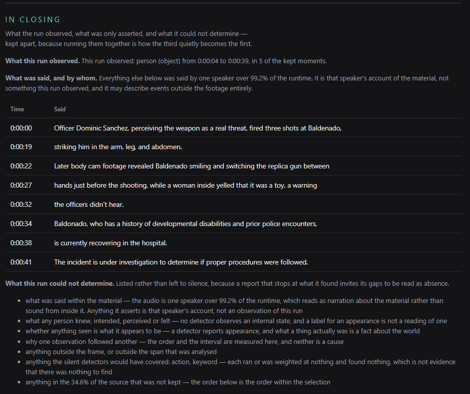

# Why these moments

Every run writes a report next to the highlight — one self-contained HTML file
you can open or email. Nothing is fetched when it loads; the thumbnails are
embedded.

It is not a summary. It is the arithmetic: for each moment kept, the per-signal
point breakdown, which objects and actions fired, the confidence tier each one
landed in, and whether the multi-signal boost applied. Around that sit the clips
in cut order, the video in chapters, the moments that scored well and still did
not make it, and the exact settings the run used.

**A whole report, unedited:
[open the example](https://aseiel.github.io/VideoHighlighter-site/example-report.html)**
— 6 clips out of a minute of footage. The file itself is in the repo at
[`examples/escalated_highlight_why.html`](examples/escalated_highlight_why.html);
its six inline players stay empty there unless the source video sits beside it.

## Three sections earn it its keep

### Said here, measured nowhere

Lines from the transcript that no class or event this run produced shares a word
with. The report quotes them and states that it has no measurement for them,
rather than quietly scoring them as though it did.

### What to try next

Worked out from that run's own numbers, each point backed by the figures shown
beside it rather than by a guess about what you meant. It reads like this:

> **The highlight came out shorter than you asked for.** You asked for up to
> 46s and got 30s. In MAX mode the cut stops when it runs out of moments that
> scored anything at all — not when it runs out of budget. *Try:* lower the
> detector thresholds so more moments score, give another signal a weight, or
> accept the shorter cut — padding it means including moments nothing was
> detected in.

### In closing

What the run observed, what was only asserted and by whom, and what it could not
determine, kept apart — because running them together is how the third quietly
becomes the first:

Detections are the run's own observations. A transcript is one speaker's
account, and may describe things that never appear in the frame — so it is
attributed, not merged in. And the limits are listed rather than left to
silence, because a report that stops at what it found invites its gaps to be
read as absence. A model writes the chapter prose, but every boundary and figure
it is handed was computed before it saw them.

## Not a paid feature

Explanation is never a paid feature. The report, the findings and the advisor
are identical in the free and Pro editions. A cloud tool gives you a button and
a result you cannot interrogate; answering "why", locally, is what this is
instead.

## See also

- [Choosing a detector](DETECTION-GUIDE.md) — what each engine measures, and so
  what the report can attribute a moment to.
- [The Auto pipeline](AUTO-PIPELINE.md) — card to finished film in one resumable
  job.
